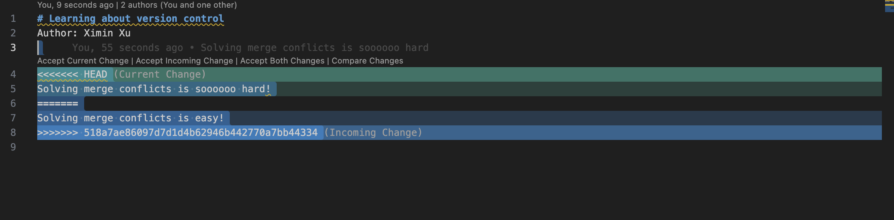

# Learning about version control
Author: Ximin Xu

Solving merge conflicts takes conscious effort, but I can do it!

I feel confused that why can only we source main branch when creating a new branch.